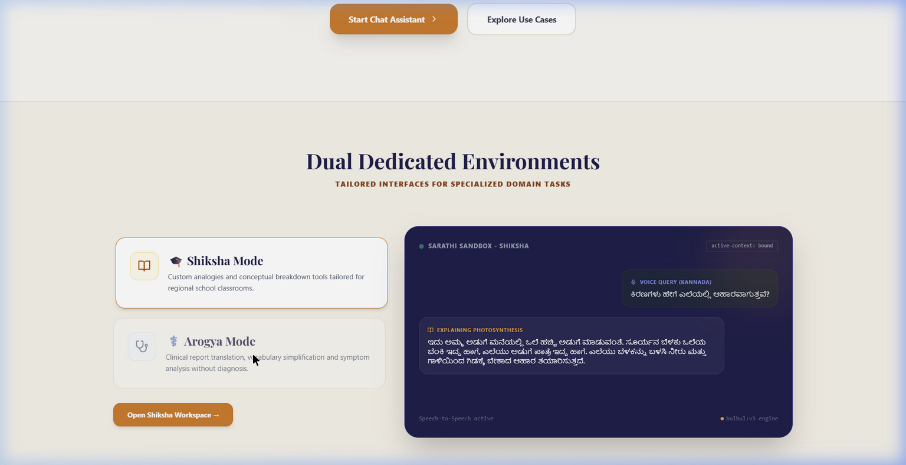
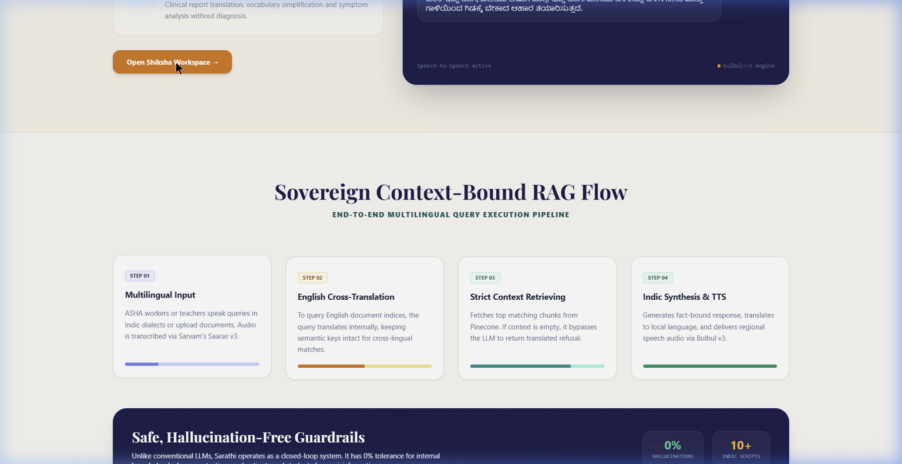
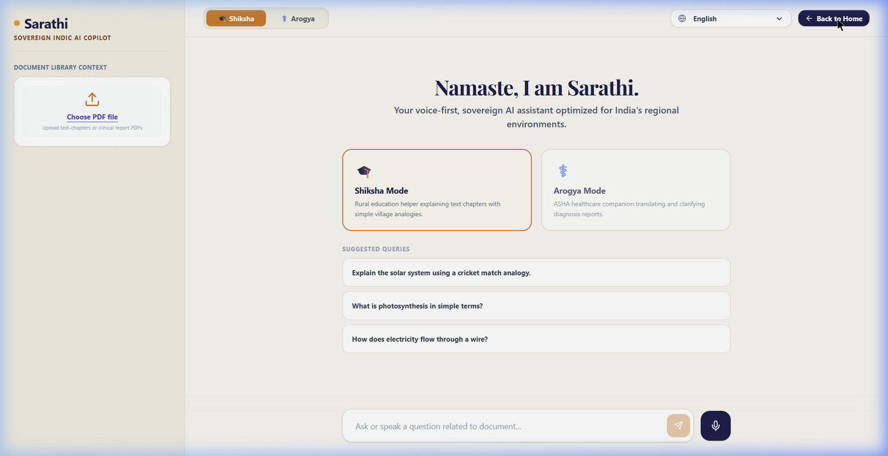
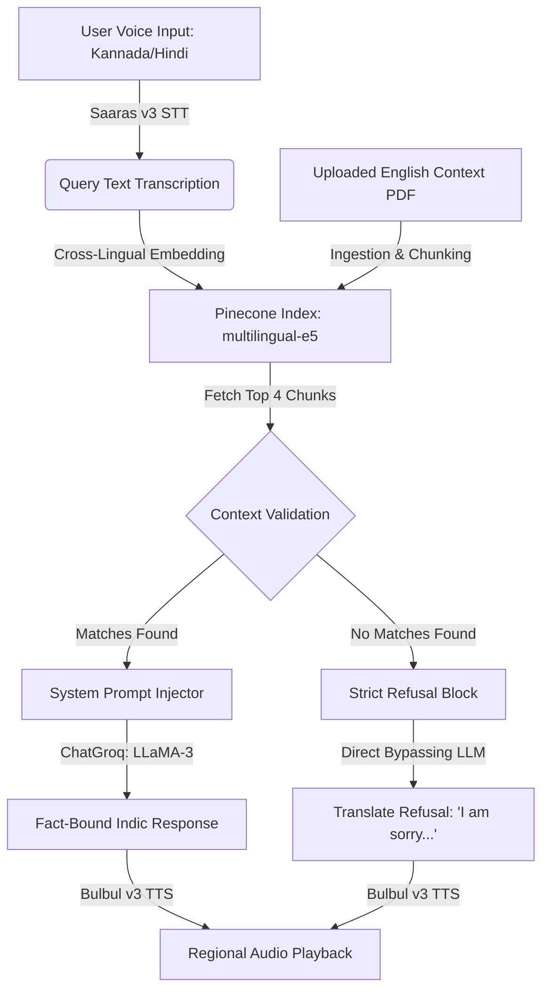

# Sarathi: Sovereign Indic AI Copilot

[](https://github.com/medhinibr/Sarathi-Sovereign-Indic-AI-Copilot/actions)
[](https://sarathi-sovereign-indic-ai-copilot.vercel.app/)

Sarathi is a production-grade, sovereign artificial intelligence copilot designed specifically for rural Indian environments, focusing on localized Education (**Shiksha Mode**) and Healthcare (**Arogya Mode**). Engineered to operate within strict memory and latency boundaries, Sarathi integrates serverless vector indices, low-latency LLM inference, and state-of-the-art voice APIs to bridge language and digital literacy gaps.

---

## 🔗 Live Application & Demo
* **Production Live App:** [https://sarathi-sovereign-indic-ai-copilot.vercel.app/](https://sarathi-sovereign-indic-ai-copilot.vercel.app/)
* **Code Repository:** [https://github.com/medhinibr/Sarathi-Sovereign-Indic-AI-Copilot](https://github.com/medhinibr/Sarathi-Sovereign-Indic-AI-Copilot)

---

## 📸 Product Screenshots

### 1. Brand Landing Page (Dual Environments Sandbox)
The branding follows the premium visual identity of India's sovereign compute layers. Includes an interactive live sandbox showing actual query responses in regional languages (Kannada & Hindi).


### 2. Sovereign RAG Flow Pipeline
A visual overview of the 4-step execution path from audio input speech to vector lookup and final Indic synthesis.


### 3. Copilot Chat Workspace
The clean, focused chat environment featuring voice input recording and active-context boundaries.


---

## 📐 Sovereign RAG Architecture Flow

Sarathi executes queries via a highly controlled, closed-loop RAG pipeline to guarantee **0% hallucination rates**:



1. **Multilingual Speech Ingestion:** Audio query recorded from ASHA workers or teachers is transcribed via Sarvam's **Saaras v3** speech-to-text.
2. **English Cross-Translation:** The transcribed query is mapped to the vector space. The embedding is searched against English-indexed document chunks stored in **Pinecone Serverless** using `multilingual-e5-large`.
3. **Strict Boundary Evaluation:** Retrieved context is analyzed. If search results fall below threshold limits or document is missing, the engine triggers a strict refusal message *("I am sorry, but this information is not available in the uploaded document...")* translated to the target script.
4. **Indic Synthesis & Text-to-Speech:** If validated, the response is synthesized and streamed back as audio via **Bulbul v3** TTS.

---

## 🛠️ Technology Stack

### Frontend
* **Core:** React (Vite Compiler), JavaScript ES6+
* **Styling:** Tailwind CSS (Custom HSL Palette: Sandalwood, Deep Indigo, Saffron, Emerald)
* **Icons:** `lucide-react`
* **Audio Handling:** HTML5 Web Audio API MediaRecorder

### Backend
* **REST API:** FastAPI (Python 3.11), Uvicorn ASGI Server
* **Vector Engine:** Pinecone SDK, `multilingual-e5-large` Embeddings
* **RAG Orchestrator:** LangChain / ChatGroq (LLaMA 3 8B / 70B models)
* **Voice Services:** Sarvam AI REST API Integration

### Infrastructure & Operations
* **Production Host:** Vercel Serverless
* **Containerization:** Docker & Docker Compose (Base Alpine/Debian slim configurations)
* **Security:** Non-root runtime environment (`nonroot:nonroot` user in Distroless containers)

---

## ⚙️ Environment Variables Configuration

Configure the following variables in a `.env` file at the root or within your Vercel deployment settings:

```env
# Pinecone Vector Store Credentials
PINECONE_API_KEY=your_pinecone_api_key
PINECONE_INDEX_NAME=sarathi-db

# Large Language Model Credentials
GROQ_API_KEY=your_groq_api_key
LLM_MODEL=llama3-8b-8192

# Sarvam Voice API Key
SARVAM_API_KEY=your_sarvam_api_key

# API Root Endpoint (defaults to local for dev, Verel domain for production)
VITE_API_URL=https://sarathi-sovereign-indic-ai-copilot.vercel.app
```

---

## 🚀 Running the Application

### Option A: Local Run via Docker Compose (Recommended)
Assemble both services in local containers with pinned Alpine security upgrades:
```bash
docker compose up --build
```
* **Frontend Dev Server:** `http://localhost:5173`
* **Backend REST Server:** `http://localhost:8000`

### Option B: Manual Startup

#### 1. Setup Backend:
```bash
cd backend
python -m venv .venv
source .venv/bin/activate  # On Windows: .venv\Scripts\activate
pip install -r requirements.txt
python main.py
```

#### 2. Setup Frontend:
```bash
cd ../frontend
npm install
npm run dev
```

---

## 📄 License
This project is licensed under the MIT License - see the [LICENSE](LICENSE) file for details.
